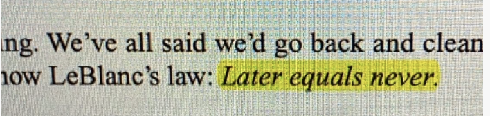

# Ch 1 : Clean Code


> - will be able to tell the difference between good code and bad code
>
> - will know how to write good code
>
> - will kow how to transform bad code into good code





### clean code란 무엇인가

```
"code-sense" 를 가지고 있다는 것!

- A programmer with "code-sense" will look at a messy module and see options and variations
- code-sence will help choose the best variation, guide him or her to plot a sequence of behavior preserving transformation to get from here to there.
```

- "elegant" - pleasingly graceful
- "efficient" - desire for speed
- "focused" -  clean code does one thing well. each function, each class, each module expose a single-minded attituded
- "readability" - clean code should read like well-written prose


### bad code는 해롭다

```
As the mess builds, the productivity of the team continues to decreasem asympotically approaching zero.
```

- release cyles are stretched
- bugs not repaired
- crash increases
- *you will not make the deadline by making the mess!*


### bad code의 원인

- to meet the deadline?
- trying to go fast
- me in rush

```
Why? Because we are "unprofessional"
```


### The code has to be "kept clean"

- It's not enough to write the code well. The code has to be kept clean over time.
- check-in out code a little cleaner than we checked it out, the code simply could not rot.
- 작고 사소한 것부터 깨끗하게 관리하자!
  - change one variable name for the better
  - break up one function that's a little too large
  - eliminate one small bit of duplication
  - clean up one compisite `if` statement