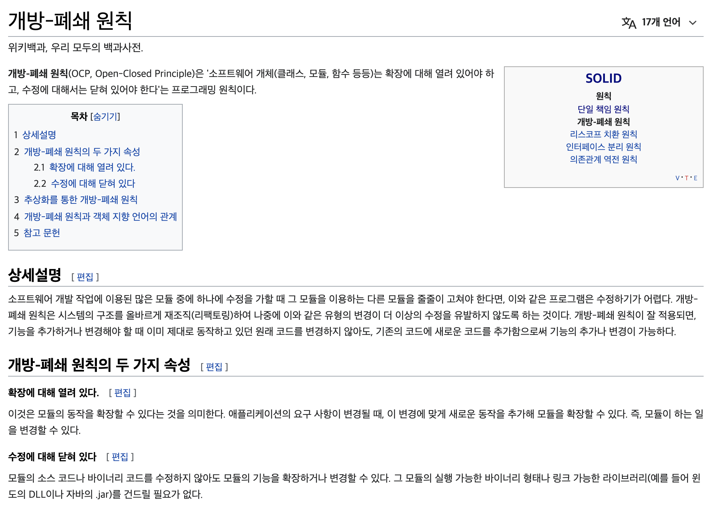

# Ch 3 : Functions


> - will be able to tell the difference between good code and bad code
> - will know how to write good code
> - will kow how to transform bad code into good code


```bash
Functions are the verbs of that language, and classes are the nouns.
```


### Small!

> The first rule of functions is that they should be small. 
>
> The second rule of functions is that they should be smaller than that.

```bash
two, or three, or four lines long.
```

```bash
the indent level of a function should not be greater than one or two. 
```


### Do One Thing

> FUNCTIONS SHOULD DO ONE THING. THEY SHOULD DO IT WELL. THEY SHOULD DO IT ONLY.


### One Level of Abstraction per Function

In order to make sure our functions are doing “one thing,” we need to make sure that the statements within our function are all at the same level of abstraction.

##### The Stepdown Rule

```bash
To say this differently, we want to be able to read the program as though it were a set of TO paragraphs, each of which is describing the current level of abstraction and referencing subsequent TO paragraphs at the next level down.
```


### Switch Statements

bury the switch statement in the basement of an ABSTRACT FACTORY

- if/else chains
- **Single Responsibility Principle(SRP)  단일 책임 원칙** 

```bash
every module, class or function in a computer program should have responsibility over a single part of that program's functionality, and it should encapsulate that part.
```


- **Open Closed Principle (OCP) 개방 폐쇄 원칙** 




### Use Descriptive Names

A long descriptive name is better than a short enigmatic name


### Function Arguments

> The ideal number of arguments for a function is zero (niladic). 
>
> Next comes one (monadic), followed closely by two (dyadic). 
>
> Three arguments (triadic) should be avoided where possible. 
>
> More than three (polyadic) requires very special justification.


### Command Query Separation

Functions should either do something or answer something, but not both.


### Prefer Exceptions to Returning Error Codes

if you use exceptions instead of returned error codes, then the error processing code can be separated from the happy path code and can be simplified


### Don't Repeat Yourserlf(DRY)

Duplication may be the root of all evil in software.


### Structured Programming

```
there should only be one return statement in a function, no break or continue statements in a loop, and never, ever, any goto statements.
```


### How Do You Write Functions Like This?

=> **write the first draft, refine that code, splitting out functions, chagning names, eliminating duplication!**
