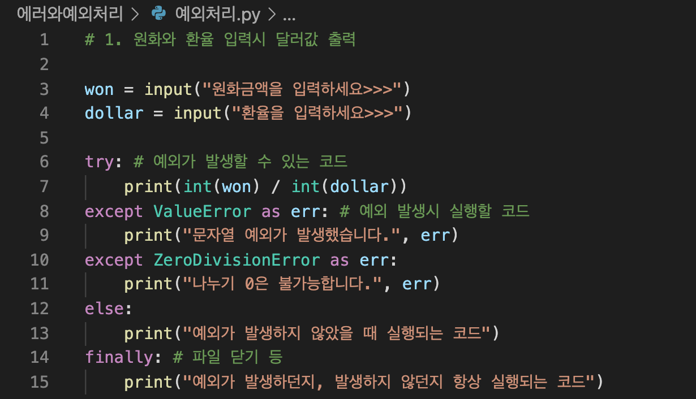

# Error Handling

> 깨끗한 코드는 읽기 쉽지만, 또한 강력해야 한다.  상충되어 보이지만 가능하다.
>
> 에러 핸들링을 메인 로직과 구분해야 한다.

## 반환 코드대신 Exceptions 를 사용하라

Use Exceptions Rather Than Return Codes B

- 과거에는 error flag를 사용하거나 caller 가 체크할 수 있는 에러코드를 사용하였다.
- 하지만 이 경우 caller 가 call 직후 에러를 바로 처리해야 해서, 잊기 쉬웠다.
- 따라서 exception을 만들어주는 것이 명확하다. 그래야 calling code가 에러 핸들링에 의해 모호해지지 않는다.
- 코드와 에러를 구분하자!

## Try-Catch-Finally 문을 먼저 써라

- try-catch-finally 문의 try 부분에서 코드를 실행하면 실행은 어느 시점에서든 중단될 수 있고 catch에서 다시 시작할 수 있다.

- 어떤 면에서 try 블록은 트랜잭션과 같다. 당신의 캐치는 당신의 프로그램을 시도에서 무슨 일이 일어나더라도 일관된 상태를 유지한다.

- try-catch 구조로 범위를 정의했으므로 이제 TDD를 사용하여 우리가 필요로 하는 나머지 논리를 올린다.

## Unchecked Exceptions 를 사용하라

Java 의 특징인 checked exceptions 을 사용하면 Open/Closed Principle의 원칙을 위반하게 된다.

예외가 확인되면 수정된 함수를 호출하는 모든 함수도 수정되어야 하는 문제가 발생한다.

## Exceptions 과 설명을 함께 제공하라

**error의 source와 location 즉, 원인과 발생위치를 함께 제공해야 한다.**

**error message 형태로 'exeptions'와 함께 제공하고 type of failure를 함께 기록한다.**

## caller 의 필요성을 기준으로 예외클라스를 정의하라

Define Exception Classes in Terms of a Caller’s Needs 

- **API 코드 래핑하기**
- **반복 줄이기**
- **다른 API 라이브러리로 이동하기 쉽도록 코드를 작성한다.**

## Normal Flow 를 정의하라

### 비즈니스 로직과 에러 핸들링 부분을 구분하라

 separation between your business logic and your error handling

- **외부 API 를 묶는다.**
- **handler 를 코드 윗부분에 배치하여 오류를 처리한다.**

## Null 을 리턴하지 말라

## Null 을 패스하지 말라

## 결론

깨끗한 코드는 읽기 쉽지만, 또한 강력해야 한다.  상충되어 보이지만 가능하다.

에러 핸들링을 메인 로직과 구분해야 한다.

---

# 파이썬 : 에러와 예외처리

예외처리란 프로그램 실행 중 발행하는 예외를 처리하는 것이다.

## try-except 구문, else, finally

try, except 사용시 프로그램이 끝나지 않는다!!! 그래서 장점.

> try:
>
> ​	예외가 발생할 수 있는 코드
>
> except: 
>
> ​	예외 발생시 실행할 코드
>
> else:
>
> ​	예외 발생하지 않을 시 실행할 코드
>
> finally:
>
> ​	예외 발생해도 안해도 항상 실행할 코드 (자원 리소스 반환)

- `except`에 에러 직접 지정 가능
- `as` 로 에러명 출력 가능

